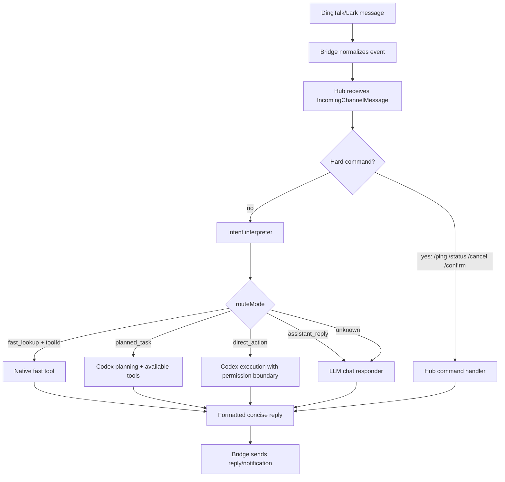

# Routing Framework

The Hub keeps routing simple: one interpreter decides the route, then one executor owns the result.

## Route Modes

- `assistant_reply`: normal chat, explanations, lightweight image/audio/document understanding.
- `fast_lookup`: mature, deterministic lookups. Requires a `toolId`; do not infer this from keyword scanning alone.
- `planned_task`: complex questions, unclear BI metric queries, multi-step reasoning, or anything needing Codex to inspect files.
- `direct_action`: local operation with side effects. Restrict to privileged senders and allowed workspace roots.
- hard commands: `/status`, `/cancel`, `/confirm`, `/reply`, `/ping`; handled by Hub directly.

## Design Rule

Use fast tools only when the workflow is stable and the expected answer shape is clear. Let Codex plan when the user asks for reasoning, diagnosis, code changes, ambiguous data interpretation, or cross-source analysis.
